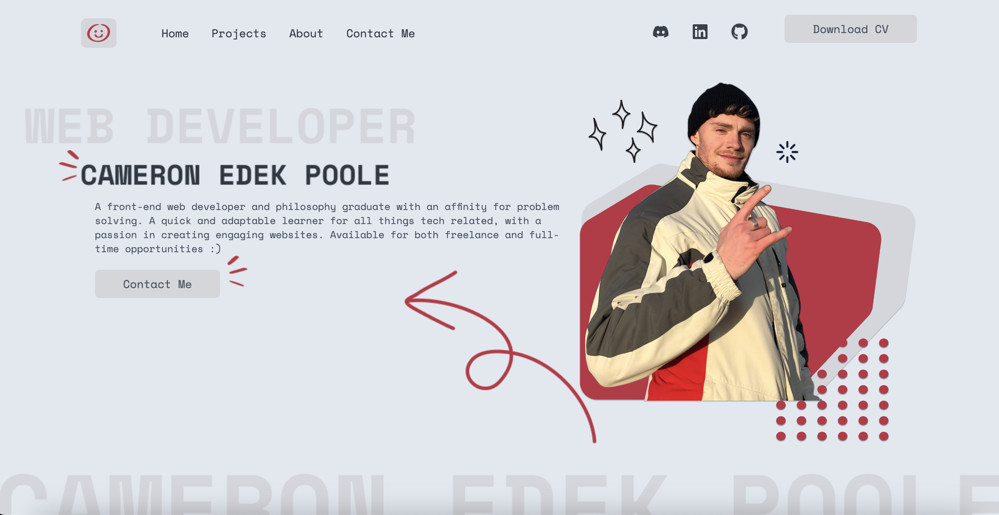
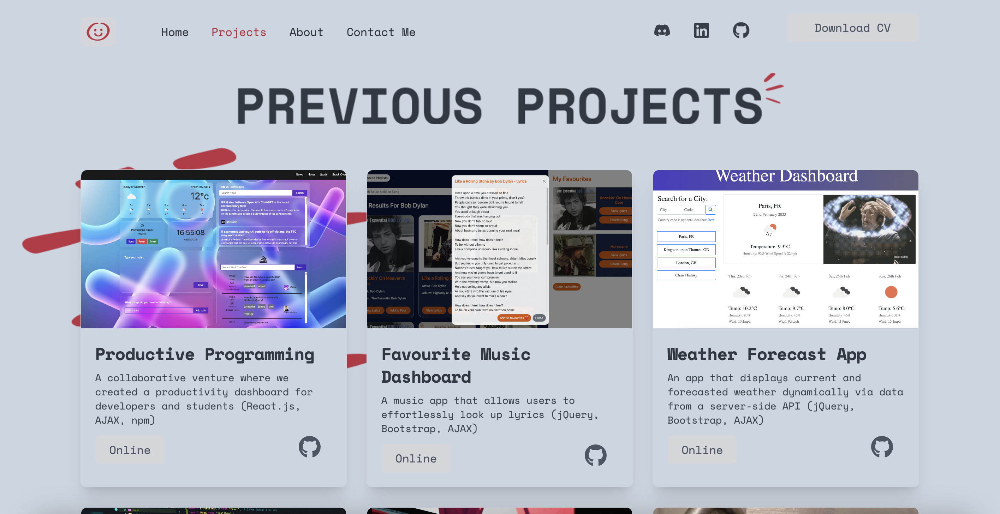

# Personal Portfolio Website

[](https://opensource.org/licenses/MIT)

A responsive personal portfolio built with Next.js and TypeScript — selected projects, an about section with a downloadable CV, and a working contact form.

**Live:** [cedekpoole-website.vercel.app](https://cedekpoole-website.vercel.app/)

## Tech stack

- **Next.js** (App Router) + **React** — routing and server-rendered pages
- **TypeScript** — type-safe components
- **Tailwind CSS** — styling
- **Framer Motion** — page and element animations
- **Sanity** (headless CMS) — project content
- **react-hook-form** — contact form handling
- **Vercel** — hosting and CI/CD

## Features

- Fully responsive across all breakpoints
- Project cards with live and GitHub links
- Downloadable CV (PDF)
- Functional contact form

## Running locally

```bash
git clone https://github.com/cedekpoole/portfolio-website.git
cd portfolio-website
npm install
```

Create a `.env.local` in the project root with your Sanity values:

```
NEXT_PUBLIC_SANITY_PROJECT_ID=your_project_id
NEXT_PUBLIC_SANITY_DATASET=production
NEXT_PUBLIC_SANITY_API_VERSION=2023-06-16
```

Then start the dev server and open <http://localhost:3000>:

```bash
npm run dev
```

## Screenshots

<!-- TODO: refresh these after the redesign — they still show the old copy/headline -->

| Home                                  | Projects                                     |
| ------------------------------------- | -------------------------------------------- |
|  |  |

## Credits

- Some icons from [Streamline](https://www.streamlinehq.com/).

## License

MIT — see [LICENSE](./LICENSE).

## Contact

Open an issue, or reach me at cameron.edek.poole@gmail.com.
[GitHub](https://github.com/cedekpoole/) · [LinkedIn](https://www.linkedin.com/in/cam-edek-poole/)
